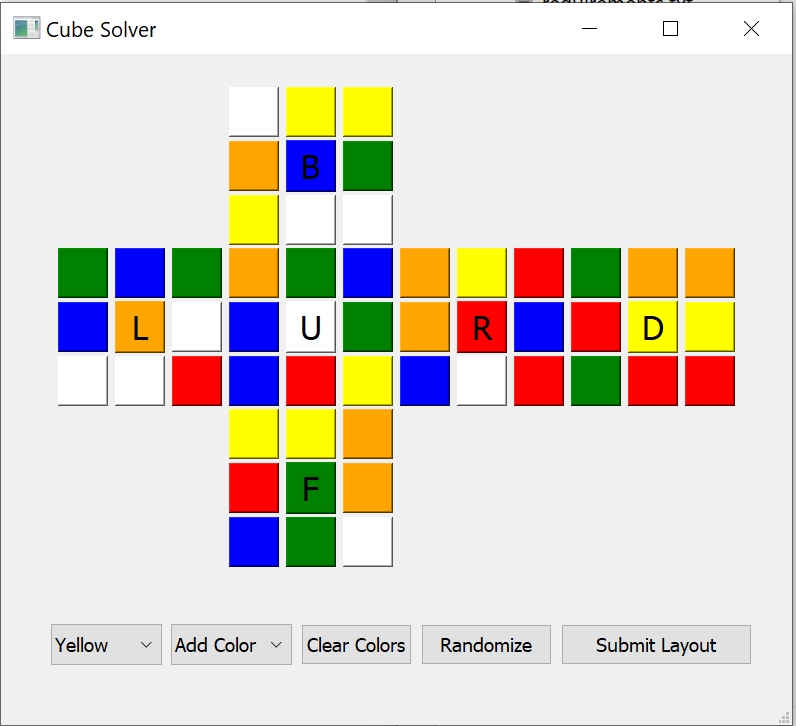
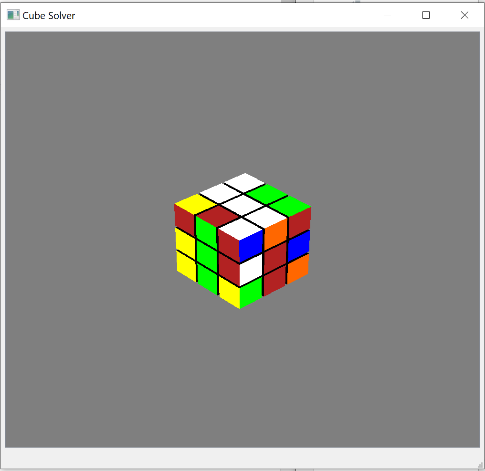

# cube-solver
Rubik's cube 3D simulation solver.

## How to use

  

1. Run app.py to open the GUI. You can either click the randomize button or enter the colors manually.  
2. From the dropdown menu, select the color of the sticker.  
3. Click on the boxes to color the sticker.  
4. Repeat for all six colors.   
5. Click the submit button to generate the solution.  
6. Wait for the program to generate the solution.    

  

7. Now watch the 3D solver solve the cube!
